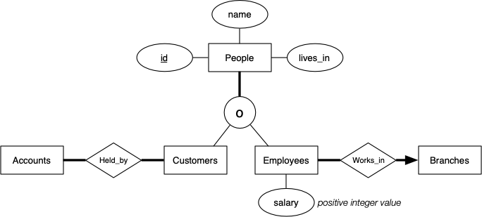

# Exam 23T1

## Question 1 (3 marks)

Write an SQL view that shows the suburbs where the most customers live.

The view should return tuples containing the name of the suburb and the number of customers who live there.

The tuples should be sorted in ascending order on the suburb.

Define the view as q1(suburb,ncust).

The expected result is:

```bash
bank=# select * from q1 order by suburb;
SET
      suburb       | ncust 
-------------------+-------
 Bondi Junction    |    13
 Brighton-Le-Sands |    13
 Kirribilli        |    13
(3 rows)
```
Instructions:
- Work on this question in the q1/ directory
- Define the q1 view in the q1.sql file
- Also, place any additional views used by q1 in this file
- Additional views must be placed before the q1 definition
- You may not use functions in answering this question, just views
- Load it into your database using:   psql bank -f q1.sql
- Sample output is in the file:   tests/01.expected
- Test it via:   select * from q1;
- Check it using:   sh check   in the q1 directory
- Submit it using:   submit q1 

## Question 2 (4 marks)

Write an SQL view that shows customers who have the same name, and a list of customer id's for each person with that name.

The customer id's in the lists should be sorted in ascending order. The tuples should be sorted in ascending order on the name.

Define the view as q2(name,ids).

The expected result:

```bash
bank=# select * from q2 order by name;
     name     |            ids             
--------------+----------------------------
 Aaron Tang   | 13052732,13164707
 Amy Chen     | 12990590,13060300
 Bing Xu      | 12938404,13166300
 Charles Wong | 12944032,13031328
 Edwin Lee    | 12945492,12946453
 Jane Ho      | 13079000,13102437,13102798
 Jennifer Wu  | 13145859,13196088
 Jia Wang     | 12900407,13132271
 Jing Zhang   | 13083188,13299870
 Matthew Kim  | 13035095,13040110
 Peter Hall   | 13253904,13324406
 Tsz Kwan     | 12891559,13104969
 Xiao Zhu     | 13173428,13178334
(13 rows)
```

Instructions:
- Work on this question in the q2/ directory
- Define the view q2 in the file q2.sql
- Also, place any additional views used by q2 in this file
- You may not use functions in answering this question, just views
- Additional views must be placed before the q2 definition
- Load it into your database using:   psql bank -f q2.sql
- Sample output is in the file:   tests/01.expected
- Test it via:   select * from q2;
- Check it using:   sh check   in the q2 directory
- Submit it using:   submit q2 

## Question 4 (8 marks)

Write a PLpgSQL function that checks, for a given account, that the balance stored in the Accounts is consistent with the balance that could be calculated via the transaction history on that account.

Define the function as   function q4(_acctID integer) returns text   (given in the q4.sql template file)

The argument (_acctID) is an Accounts.id value. The function should initially check that the _acctID value corresponds to a real account, and return the string

```
No such account
```

if it does not.

You can assume that the sequence of transactions on an account represents the entire history of activity on that account, starting with the initial deposit when the acount was created (always the first transaction).

Calculate the expected balance by scanning the history of transactions involving that account. For each transaction:
- a deposit increases the balance in the account
- a withdrawal decreases the balance in the account
- a transfer decreases the balance if the account is the source or increases it if the account is the destination 

After scanning all transactions, you will have a calculated balance B. Compare that to the Accounts.balance for the account (abbreviated as A for this discussion).

If (A == B), return the string

```
OK
```

If (A != B), return the string

```
Mismatch: calculated balance B, stored balance A
```

where A and B in the string are substituted by the actual values.

An example of usage is below. There are more examples in the tests directory.

```bash
bank=# select q4(12345);
       q4        
-----------------
 No such account
(1 row)

bank=# select q4(610800);
 q4 
----
 OK
(1 row)

bank=# select q4(654167);
                           q4                           
--------------------------------------------------------
 Mismatch: calculated balance 1400, stored balance 1000
(1 row)
```

Instructions:
- Work on this question in the q4/ directory
- Define the function q4(...) in the file q4.sql
- Also, place any additional views/functions used by q4 in this file
- These must be placed before the q4 definition
- Load it into your database using:   psql bank -f q4.sql
- Sample output is in the files:   tests/*.expected
- Test it via:   select * from q4(...);
- Check it using:   sh check   in the q4 directory
- Submit it using:   submit q4 

## Question 5 (9 marks)

Write a Python3/Psycopg2 script that given a branch location, prints detail of all the accounts held at that branch, and checks that the Branches.assets is equal to the sum of the balances of all the accounts that are held at that branch.

It takes one command-line argument, a suburb name, which must match exactly one of the branch locations in the database. If the suburb name does not exist or does not exactly match the name in the database, print the message:

```
No such branch SuppliedName
```

and exit the script.

If the database contains a branch in the given suburb, print the suburb name and the branch ID in parentheses. Then, for each account held at that branch, print one line containing:

    the account ID
    the name of the owner of the account
    (you can assume that we won't ask about jointly owned accounts)
    the suburb where the account owner lives
    the balance in the acount 

These lines must exactly follow the format in the examples below. However, the order in which the accounts are displayed does not matter.

While scanning the accounts, accumulate the total of all balances. This should match the Branches.assets field for that branch. If it does, simply print the assets value. If the calculated total is different from the stored assets, print the assets and then print the message:

```
Discrepancy between assets and sum of account balances
```

The examples below show the expected output format:

```bash
$ python3 ./q5.py Nowhere
No such branch Nowhere

$ python3 ./q5.py blacktown
No such branch blacktown    -- must match suburb name exactly

$ python3 ./q5.py Flemington
No such branch Flemington    -- valid suburb name, but no branch there

$ python3 ./q5.py Willoughby
Willoughby branch (2140) holds
- account 608947 owned by Xinting Hui from Banksmeadow with $1700
- account 610028 owned by Dominic Starr from Balgowlah Heights with $700
- account 623616 owned by Craig Moran from Bundeena with $1300
- account 632673 owned by Paul Chapman from Waverley with $100
- account 634590 owned by Ida Landstad from Carlton with $2500
- account 639175 owned by Ka Lai from Redfern with $500
- account 641849 owned by Stephanie Tham from Terrey Hills with $500
Assets: $7300

$ python3 ./q5.py Sydenham
Sydenham branch (2089) holds
- account 617075 owned by Jay Liao from Eastlakes with $0
- account 620225 owned by Tim Ralston from Brighton-Le-Sands with $1100
- account 620452 owned by Alison Atkins from Sydenham with $1600
- account 635354 owned by Joyce Taslim from Peakhurst with $100
- account 639756 owned by Lai So from Cammeray with $2200
- account 644770 owned by Monradee Ly from Clontarf with $600
- account 645401 owned by Brian Chui from Eastwood with $2900
- account 645520 owned by Christine Neal from Clontarf with $1500
- account 650718 owned by Nuntapol Jirawansirikul from Blair Athol with $1100
- account 651403 owned by Jia Wang from Lavender Bay with $100
- account 651604 owned by Kah Hair from Westmead with $500
- account 654167 owned by Janna Ou from Sydenham with $1000
Assets: $13100
Discrepancy between assets and sum of account balances
```

There are more examples in the tests/*.expected files.

Instructions:
- Work on this question in the q5/ directory
- Put any SQL code for helper views and functions in q5.sql
- Make sure that you load q5.sql into the database before testing;
- the command   psql bank -f q5.sql   will do this
- Put the Python code in the file q5.py
- Put any Python helper functions in this file as well
- Test it via:   python3 q5.py ...
- Check it using:   sh check   in the q5 directory
- Submit it using:   submit q5
- This command submits both q5.py and q5.sql 

## Question 6 (8 marks)

Consider the following ER diagram:



Map this ER diagram to two different SQL schemas as follows:
1. using the ER-style mapping for the subclasses
1. using the single-table mapping for subclasses

Every table must have a primary key defined.

The definitions must reflect the constraints implied in the ER diagram. If some constraint cannot be implemented, make a note of this as an SQL comment in your schema.

You don't need to define the Accounts and Branches tables; assume they have the same definition as in the Bank schema.

Instructions:
- Work on this question in the q6/ directory
- Type your answers to this question into a file called q6.txt
- Submit via:   submit q6
