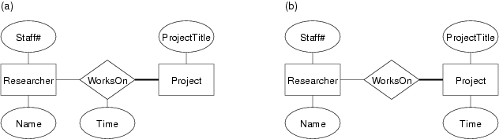
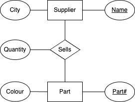

# Week02 Tutorial - Data Modelling, ER Model, Relational Model

## Q2

In the context of database application development (aka "database engineering"), what are the aims of data modelling?

### Ans

- Build description of entities from requirements.
- Data model should give enough detail so that a DB schema can be derived without significant additional information.

## Q3

Describe the similarities and differences between the following similarly-named concepts:
- relationship in the entity-relationship data model
- relation in the relational data model

### Ans

Relationship:
- describes association between n specific entities
- a collection of relationships which forms a relationship set
- a relationship can have associated attributes

Relation:
- describes an association between collection of attributes
- an instance of a relation is a set of tuples of attribute values
- a relation can be used to model a set of entities
- a relation can also be used to model relationship sets
- every relation has a primary key

## Q4

What kind of data, relationships and constraints exist in this scenario?
- for each person, we need to record their tax file number (TFN), their real name, and their address
- everyone who earns money in Australia has a distinct tax file number
- authors write books, and may publish books using a ``pen-name'' (a name which appears as the author of the book and is different to their real name)
- editors ensure that books are written in a manner that is suitable for publication
- every editor works for just one publisher
- editors and authors have quite different skills; someone who is an editor cannot be an author, and vice versa
- a book may have several authors, just one author, or no authors (published anonymously)
- every book has one editor assigned to it, who liaises with the author(s) in getting the book ready for publication
- each book has a title, and an edition number (e.g. 1st, 2nd, 3rd)
- each published book is assigned a unique 13-digit number (its ISBN); different editions of the same book will have different ISBNs
- publishers are companies that publish (market/distribute) books
- each publisher is required to have a unique Australian business number (ABN)
- a publisher also has a name and address that need to be recorded
- a particular edition of a book is published by exactly one publisher 

### Ans

Entities and attributes:
- Person: **TFN**, real name, address
- Author: person, pen name
- Book: title, author, editor, publisher
- Publisher: **ABN**, name, address
- Editor: person, publisher

Relationships:
- Editors work for a publisher
- Author writes books
- Editor edits books

## Q5

Consider some typical operations in the myUNSW system...
- student enrols in a lab class
- student enrols in a course
- system prints a student transcript 

For each of these operations:
- identify what data items are required
- consider relationships between these data items
- consider constraints on the data and relationships

### Ans

Data items required:
- Student: name, 
- Lab: name, location, capacity, staff
- Location: building, grid

Relationships:
- Labs have a location
- Students are enrolled in lab

Constraints:
- Labs can have no more than X students.

## Q6

Researchers work on different research projects, and the connection between them can be modelled by a WorksOn relationship. Consider the following two different ER diagrams to represent this situation.

Describe the different semantics suggested by each of these diagrams.

### Ans

A indicates how long a researcher works on a project.

B indicates how much time a project could be worked on in total and by any number of researchers.

## Q7

Draw an ER diagram for the following application from the manufacturing industry:
- Each supplier has a unique name.
- More than one supplier can be located in the same city.
- Each part has a unique part number.
- Each part has a colour.
- A supplier can supply more than one part.
- A part can be supplied by more than one supplier.
- A supplier can supply a fixed quantity of each part.

### Ans

## Q8

The following two ER diagrams give alternative design choices for associating a person with their favourite types of food. Explain when you might choose to use the second rather than the first:

### Ans

Second is scalable - can add attributes.

## Q9

[Based on RG 2.2] Consider a relationship Teaches between teachers and courses. For each situation described below, give an ER diagram that accurately models that situation:
- Teachers may teach the same course in several semesters, and each must be recorded
- Teachers may teach the same course in several semesters, but only the current offering needs to be recorded (assume this in the following parts)
- Every teacher must teach some course
- Every teacher teaches exactly one course
- Every teacher teaches exactly one course, and every course must be taught by some teacher
- A course may be taught jointly by a team of teachers 

You may assume that the only attribute of interest for teachers is their staff number while for courses it is the course code (e.g. COMP3311). You may introduce any new attributes, entities and relationships that you think are necessary.

### Ans

## Q10

