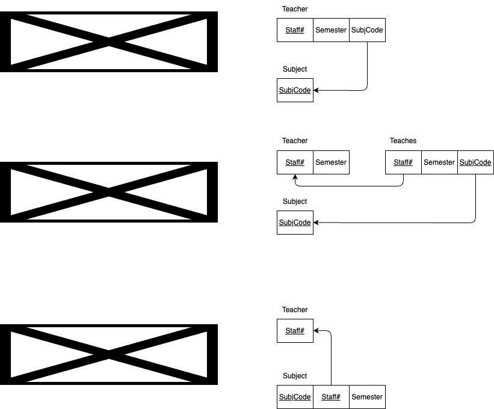
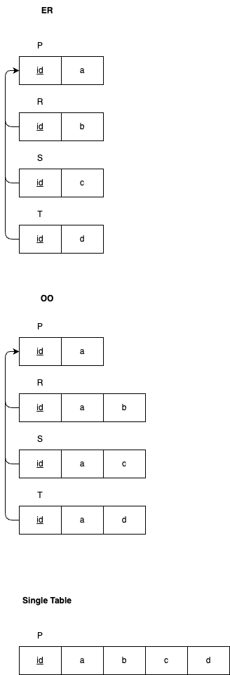
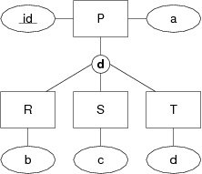
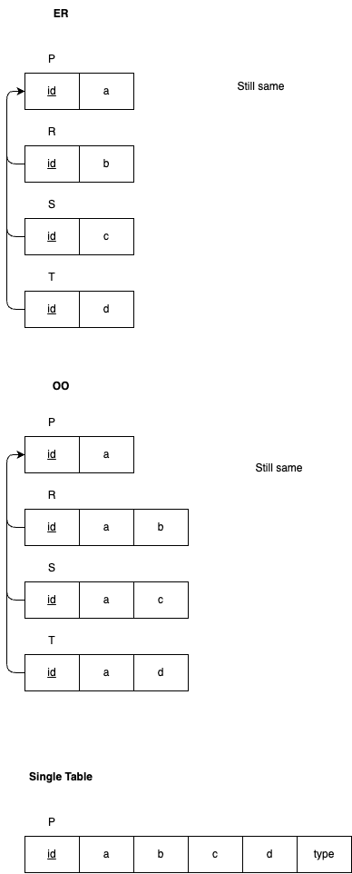
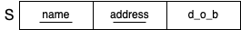
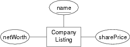
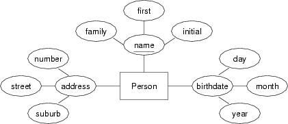
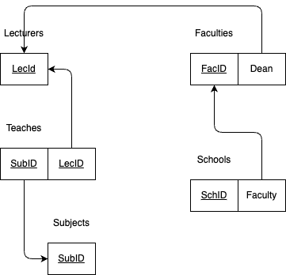
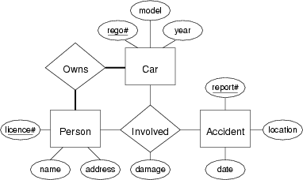
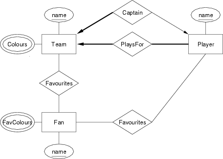

# Week03 Tutorial - ER→Rel Mapping, SQL DDL, ER→SQL Mapping

## Q1

Why is it useful to first do an ER design and then convert this into a relational schema?

### Ans

- Allows designers to start high level with abstract view of data and relationships.

## Q2

Convert each of the following ER design fragments into a relational data model expressed as a box-and-arrow diagram:

### Ans



## Q3

In the mapping from the ER model to the relational model, there are three different ways to map class hierarchies (ER, OO, single-table). Show each of them by giving the mapping for the following class hierarchy:


Use box-and-arrow diagrams for the relational models.

### Ans



## Q4

Now consider a variation on the above class hierarchy where the sub-classes are disjoint. Show the three possible mappings for the class hierarchy and discuss how effectively they represent the semantics of the disjoint sub-classes:



Use box-and-arrow diagrams for the relational models.

### Ans



## Q5

Consider the following two relation definitions:



For each, show the possible ways of defining the primary key in the corresponding SQL  create table  statement.

### Ans

A:
```sql
-- Prefer
create table R (
    id integer,
    name text,
    address text,
    d_o_b date,
    primary key (id)
);

-- Alt
create table R (
    id integer primary key,
    name text,
    address text,
    d_o_b date
);
```

B:
```sql
create table R (
    name text,
    address text,
    d_o_b date,
    primary key (name, address)
)
```

## Q6

Give examples of constraints that
- apply to an individual attribute
- apply across a whole table
- apply between tables

### Ans

```sql
-- Individual attribute
x integer check (x > 0)
y integer not null
d date check (t between '2020-01-01' and '2022-12-31')

-- Whole table
id integer primary key
z integer unique

-- Between tables
create table R (
    x integer primary key,
    y float,
);

create table S (
    a integer primary key,
    b integer references R(x) -- b is a foreign key on R.x
);
```

## Q7

What is the difference between the following two ways to define a primary key?

```sql
create table R (                    create table R (
    a integer primary key,              a integer,
    b integer,                          b integer,
    ...                                 ...
);                                      primary key (a)
                                    );
```

### Ans

Second allows multiple keys.

## Q8

Discuss suitable SQL representations for each of the following attributes, including additional domain constraints where relevant:

### Ans

```sql
-- Dollar
value numeric(20, 2)
value money -- PostgreSQL

-- Mass
mass float check (mass >= 0.0) -- kg
```

## Q9

In many real PostgreSQL schemas, you will see definitions like

```sql
create table R (
    id    serial,
    name  text,
    d_o_b date,
    ...
    primary key (id)
);
```

- What is the effect of the serial declaration?
- How would you make use of it when inserting tuples?
- How would you reference R.id as a foreign key?

### Ans

- Serial declaration generates sequence of consecutive and unique integer values.
- To make use of `id`:
    ```sql
    insert into R(name, d_o_b) values ('John', '1972-02-28') returning id;
    ```
- To ref `R.id` as foreign key:
    ```sql
    fk integer references R(id) -- fk is a foreign key on R.id
    ```

## Q10

Convert the following entity into an SQL CREATE TABLE definition:



Give reasons for all choices of domain types.

### Ans

```sql
create table CompanyListings {
    name char(4),
    netWorth float(6, 2),
    sharePrice float(20, 2),
    primary key (name)
};
```

## Q11

Convert the following entity into an SQL CREATE TABLE definition:



Give reasons for all choices of domain types.

### Ans

```sql
create table Persons {
    firstName varchar(30),
    familyName varchar(30),
    initial char(1),
    streetNumber integer,
    streetName varchar(40),
    suburb varchar(40),
    birthday date,
    primary key (familyName, firstName, initial)
};
```

## Q12

Convert the following ER design into a relational data model:


You can assume that each attributes contains (at least) a suitably-named attribute containing a unique identifying number (e.g. the Lecturer entity contains a LecID attribute).

### Ans



## Q13

Convert the following ER design into an SQL schema:


Which elements of the ER design do not appear in the relational version?

### Ans

```sql
create table Suppliers {
    name text,
    city text,
    primary key (name)
};

create table Parts {
    number integer,
    colour text,
    primary key (number)
};

create table Supplies {
    quantity integer,
    supplier text,
    part integer,
    foreign key (supplier) references Suppliers(name),
    foreign key (part) references Parts(number)
}
```

- All elements appear in relational model.

## Q14

Convert the following ER design into a relational data model expressed first as a box-and-arrow diagram and then as a sequence of statements in the SQL data definition language:



Which elements of the ER design do not appear in the relational version?

### Ans

```sql
create table Cars {
    regoID integer,
    model text,
    year integer(4),
    primary key (regoID)
};

create table Persons {
    licenseID integer,
    name text,
    address text,
    primary key (licenseID)
};

create table Owns {
    rego integer,
    license integer,
    foreign key (rego) references Cars(regoID)
    foreign key (license) references Persons(licenseID)
};

create table Involvements {
    rego integer,
    license integer,
    report integer,
    damage text,
    foreign key (rego) references Cars(regoID)
    foreign key (license) references Persons(licenseID)
    foreign key (report) references Accidents(reportID)
};

create table Accidents {
    reportID integer,
    date date,
    location text,
    primary key (reportID)
};
```

- All elements appear in relational model.

## Q15

Convert the following ER design into a relational data model expressed first as a box-and-arrow diagram and then as a sequence of statements in the SQL data definition language:



Which elements of the ER design do not appear in the relational version?

## Ans


