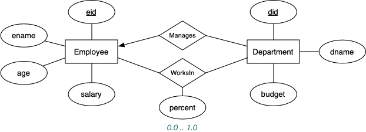
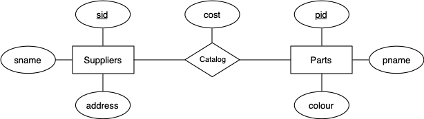

# Week04 Tutorial - SQL Constraints, Updates and Queries

Consider the following data model for a a business organisation and its employees:



Employees are uniquely indentified by an id (eid), and other obvious information (name,age,...) is recorded about each employee. An employee may work in several departments, with the percentage of time spent in each department being recorded in the WorksIn relation (as a number in the range 0.0-1.0, with 1.0 representing 100%). The percentages for a given employee may not sum to one if the employee only works part-time in the organisation. Departments are also uniquely identified by an id (did), along with other relevant information, including the id of the employee who manages the department.

Based on the ER design and the above considerations, here is a relational schema to represent this scenario:

```sql
create table Employees (
      eid     integer,
      ename   text,
      age     integer,
      salary  real,
      primary key (eid)
);
create table Departments (
      did     integer,
      dname   text,
      budget  real,
      manager integer references Employees(eid),
      primary key (did)
);
create table WorksIn (
      eid     integer references Employees(eid),
      did     integer references Departments(did),
      percent real,
      primary key (eid,did)
);
```

Answer each of the following questions for this schema...

## Q1

Does the order of table declarations above matter?

## Q2

A new government initiative to get more young people into work cuts the salary levels of all workers under 25 by 20%. Write an SQL statement to implement this policy change.

## Q3

The company has several years of growth and high profits, and considers that the Sales department is primarily responsible for this. Write an SQL statement to give all employees in the Sales department a 10% pay rise.

## Q4

Add a constraint to the CREATE TABLE statements above to ensure that every department must have a manager.

## Q5

Add a constraint to the CREATE TABLE statements above to ensure that no-one is paid less than the minimum wage of $15,000.

## Q6

Add a constraint to the CREATE TABLE statements above to ensure that no employee can be committed for more than 100% of his/her time. Note that the SQL standard allows queries to be used in constraints, even though DBMSs don't implement this (for performance reasons).

## Q7

Add a constraint to the CREATE TABLE statements above to ensure that a manager works 100% of the time in the department that he/she manages. Note that the SQL standard allows queries to be used in constraints, even though DBMSs don't implement this (for performance reasons).

## Q8

When an employee is removed from the database, it makes sense to also delete all of the records that show which departments he/she works for. Modify the CREATE TABLE statements above to ensure that this occurs.

## Q9

When a manager leaves the company, there may be a period before a new manager is appointed for a department. Modify the CREATE TABLE statements above to allow for this.

## Q10

Consider the deletion of a department from a database based on this schema. What are the options for dealing with referential integrity between Departments and WorksIn? For each option, describe the required behaviour in SQL.

## Q11

For each of the possible cases in the previous question, show how deletion of the Engineering department would affect the following database:

```sql
  EID ENAME             AGE     SALARY
----- --------------- ----- ----------
    1 John Smith         26      25000
    2 Jane Doe           40      55000
    3 Jack Jones         55      35000
    4 Superman           35      90000
    5 Jim James          20      20000

  DID DNAME               BUDGET  MANAGER
----- --------------- ---------- --------
    1 Sales               500000        2
    2 Engineering        1000000        4
    3 Service             200000        4

  EID   DID  PCT_TIME
----- ----- ---------
    1     2      1.00
    2     1      1.00
    3     1      0.50
    3     3      0.50
    4     2      0.50
    4     3      0.50
    5     2      0.75
```

Consider the following data model for a a business that supplies various parts:



Based on the ER design and the above considerations, here is a relational schema to represent this scenario:

```sql
create table Suppliers (
      sid     integer primary key,
      sname   text,
      address text
);
create table Parts (
      pid     integer primary key,
      pname   text,
      colour  text
);
create table Catalog (
      sid     integer references Suppliers(sid),
      pid     integer references Parts(pid),
      cost    real,
      primary key (sid,pid)
);
```

Write SQL statements to answer each of the following queries...

> **Note1**: all of these solutions have alternative formulations. If you think you have a better solution than the one(s) presented here, let me know.

> **Note2**: a useful strategy, when developing an SQL solution to an information request, is to express intermediate results as views; this has been done in a few solutions here, but you might like to consider reformulating more of them with views, for clarity.

## Q12

Find the names of suppliers who supply some red part.

## Q13

Find the sids of suppliers who supply some red or green part.

## Q14

Find the sids of suppliers who supply some red part or whose address is 221 Packer Street.

## Q15

Find the sids of suppliers who supply some red part and some green part.

## Q16

Find the sids of suppliers who supply every part.

## Q17

Find the sids of suppliers who supply every red part.

## Q18

Find the sids of suppliers who supply every red or green part.

## Q19

Find the sids of suppliers who supply every red part or supply every green part.

## Q20

Find pairs of sids such that the supplier with the first sid charges more for some part than the supplier with the second sid.

## Q21

Find the pids of parts that are supplied by at least two different suppliers.

## Q22

Find the pids of the most expensive part(s) supplied by suppliers named "Yosemite Sham".

## Q23

Find the pids of parts supplied by every supplier at a price less than 200 dollars (if any supplier either does not supply the part or charges more than 200 dollars for it, the part should not be selected).
